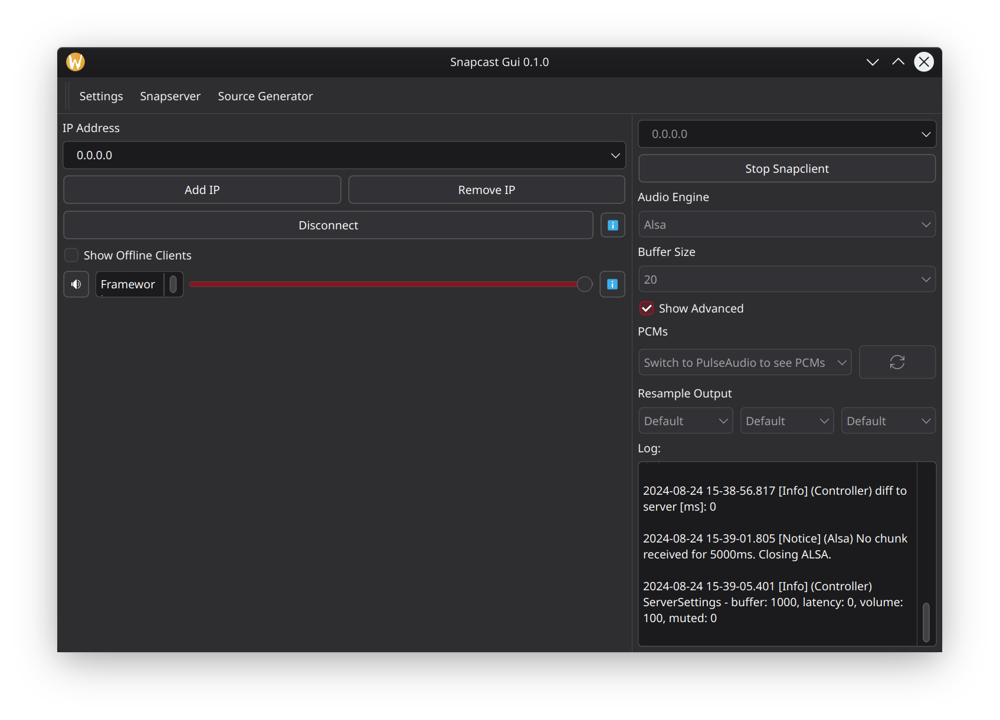

<a name="readme-top"></a>
<br />
<div align="center">
<a href="https://github.com/chicco-carone/Snapcast-Gui">

</a>

<h3 align="center">Snapcast Gui</h3>

<p align="center">
A gui to control and manage snapcast written in python with PySide6

<a href="https://github.com/chicco-carone/Snapcast-Gui/issues/new?assignees=&labels=&projects=&template=bug_report.md&title=">Report Bug</a>
·
<a href="https://github.com/chicco-carone/Snapcast-Gui/issues/new?assignees=&labels=&projects=&template=feature_request.md&title=">Request Feature</a>
</p>
</div>

<details>
<summary>Table of Contents</summary>
<ol>
<li>
<a href="#about-the-project">About The Project</a>
<ul>
<li><a href="#built-with">Built With</a></li>
</ul>
</li>
<li>
<a href="#getting-started">Getting Started</a>
<ul>
<li><a href="#prerequisites">Prerequisites</a></li>
<li><a href="#running-with-prebuilt-binaries">Running with prebuilt binaries</a></li>
<li><a href="#installation-advanced-users">Installation (Advanced Users)</a></li>
   <ul><a href="#linux-using-a-venv">Linux using a venv</ul>
   <ul><a href="#linux-from-distro-packages">Linux from distro packages</ul>
   <ul><a href="#creating-a-single-file-executable-windows-and-linux">Creating a single executable</ul>
   <ul><a href="#running-from-source">Running from source</ul>
</ul>

</li>
<li><a href="#usage">Usage</a></li>
<li><a href="#roadmap">Roadmap</a></li>
<li><a href="#contributing">Contributing</a></li>
<li><a href="#license">License</a></li>
<li><a href="#contact">Contact</a></li>
<li><a href="#acknowledgments">Acknowledgments</a></li>
</ol>
</details>

## About The Project



<p align="right">(<a href="#readme-top">back to top</a>)</p>

## Built With

* [Python](https://www.python.org/)
* [Python-Snapcast](https://github.com/happyleavesaoc/python-snapcast)
* [Python-Py_notify](https://github.com/ms7m/notify-py)
* [Pyside6](https://doc.qt.io/qtforpython/)
* [Platformdirs](https://)

<p align="right">(<a href="#readme-top">back to top</a>)</p>

## Getting Started

## Running with prebuilt binaries

Head to the [releases](https://github.com/chicco-carone/Snapcast-Gui) page on github and download the preferred binary for your platform. There are binaries for Windows and Linux

## Tested Platforms

* Arch Linux
* Debian
* Windows 10
* Windows 11
* MacOs (Not tested but should work, Open an issue if you find any issues)

## Prerequisites

Python Minimum Version >=3.9 only tested on 3.11 and 3.12

**Python Dependencies**
* snapcast
* py_notify
* PySide6
* platformdirs

**System Dependencies**
* [snapcast (optional but raccomended)](https://github.com/badaix/snapcast)

## Installation (Advanced Users)

### Linux from distro packages

**Arch Linux and derivates**

The package is available on the aur so it can be installed with an aur helper like yay or manually

```sh
yay -Sy snapcast-gui-git
```

```sh
git clone https://github.com/chicco-carone/Snapcast-Gui.git
cd Snapcast-Gui
makepkg -si
```

There is also on the [releases](https://github.com/chicco-carone/Snapcast-Gui/relases/latest) page a prebuilt arch package that can be installed with pacman

```sh
sudo pacman -U snapcast-gui.x.x.x-1-any.pkg.tar.zst
```

**Debian and Ubuntu Derivates**

On the [releases](https://github.com/chicco-carone/Snapcast-Gui/relases/latest) page of the project there is a deb package that can be installed

```sh
sudo dpkg -i snapcast-gui-x.x.x.deb
```

### Linux using a venv

1. **Clone the Repository:**

```sh
git clone https://github.com/chicco-carone/Snapcast-Gui.git
cd Snapcast-Gui
```

2. **Create and Activate a Virtual Environment:**

```sh
python -m venv venv
source venv/bin/activate
```

3. **Build the project**

```sh
pip install setuptools wheel
python setup.py sdist bdist_wheel
```

4. **Install package on venv**

```sh
pip install dist/snapcast_gui-x.x.x.tar.gz
```

### Creating a single file executable (Windows and Linux)

1. **Clone the Repository:**

```sh
git clone https://github.com/chicco-carone/Snapcast-Gui.git
cd Snapcast-Gui
```

2. **Create and Activate a Virtual Environment:**

On Linux

```sh
python -m venv venv
venv/bin/activate
```

On Windows

```powershell
python -m venv venv
.\venv\Scripts\activate.ps1
```

3. **Install Dependencies:**

```sh
pip install -r requirements.txt
pip install pyinstaller
```

4. **Create the executable**

For Linux
#### Note: The command for linux should work on MacOS too

```sh
pyinstaller --onefile --name "snapcast-gui" --add-data "icons/Snapcast.png:icons" --add-data "icons/Github.png:icons" main.py
 -onefile --add-data "snapcast_gui/icons:icons"
```

For Windows

```powershell
pyinstaller --onefile --name "snapcast-gui" --icon "icons/Snapcast.png" --add-data "icons/Snapcast.png;icons" --add-data "icons/Github.png;icons" --uac-admin --noconsole main.py
```

<p align="right">(<a href="#readme-top">back to top</a>)</p>

## Running from source

1. **Clone the Repository:**

```sh
git clone https://github.com/chicco-carone/Snapcast-Gui.git
cd Snapcast-Gui
```

2. **Create and Activate a Virtual Environment:**

On Linux

```sh
python -m venv venv
venv/bin/activate
```

On Windows

```powershell
python -m venv venv
.\venv\Scripts\activate.ps1
```

3. **Install the required dependencies**

```sh
pip install -r requirements.txt
```

2. **Run the Project:**

You can run the project directly with python from the terminal or using an ide. For developing i only used visual studio code with the python extension pack from microsoft so i can't be certain that it works with other ide.

```sh
python snapcast_gui/main.py
```

<p align="right">(<a href="#readme-top">back to top</a>)</p>

## Roadmap

See the [planned features](https://github.com/users/chicco-carone/projects/4) for a list of planned features.

See the [known issues](https://github.com/users/chicco-carone/projects/3) for a full list of known issues.

If you are having issues, please open an issue on the [issues page](https://github.com/chicco-carone/Snapcast-Gui/issues)

<p align="right">(<a href="#readme-top">back to top</a>)</p>

## Contributing

Contributions are what make the open source community such an amazing place to learn, inspire, and create. Any contributions you make are **greatly appreciated**.

If you have a suggestion that would make this better, please fork the repo and create a pull request. You can also simply open an issue with the tag "enhancement". Before doing anything always check the [known issues](https://github.com/users/chicco-carone/projects/3) and the [planned features](https://github.com/users/chicco-carone/projects/4) because something might already be there.
Don't forget to give the project a star! Thanks again!

1. Fork the Project
2. Create your Feature Branch (`git checkout -b feature/AmazingFeature`)
3. Commit your Changes (`git commit -m 'Add some AmazingFeature'`)
4. Push to the Branch (`git push origin feature/AmazingFeature`)
5. Open a Pull Request

<p align="right">(<a href="#readme-top">back to top</a>)</p>

## License

Distributed under the GPL-3 License. See `LICENSE.txt` for more information.

<p align="right">(<a href="#readme-top">back to top</a>)</p>

## Contact

Francesco - chiccocarone@gmail.com

Project Link: <https://github.com/chicco-carone/Snapcast-Gui>

<p align="right">(<a href="#readme-top">back to top</a>)</p>

## This project could not be possible without the help of the following projects

* [Snapcast](https://github.com/badaix/snapcast)
* [PySide6](https://doc.qt.io/qtforpython/)

<p align="right">(<a href="#readme-top">back to top</a>)</p>

## Using the GitHub Actions Workflow

The project now includes a GitHub Actions workflow to build the project with pyinstaller for Linux, Windows, and Mac, and to create and publish a new release with prebuilt binaries.

### Steps to Use the Workflow

1. **Trigger the Workflow:**
   - The workflow is triggered automatically on every push to the `main` branch and on every pull request to the `main` branch.

2. **Build and Release:**
   - The workflow builds the project with pyinstaller for Linux, Windows, and Mac.
   - It then creates and publishes a new release with prebuilt binaries to the GitHub releases page.

3. **Check the Release:**
   - Go to the [releases](https://github.com/chicco-carone/Snapcast-Gui/releases) page to find the newly created release with prebuilt binaries for your platform.

<p align="right">(<a href="#readme-top">back to top</a>)</p>
